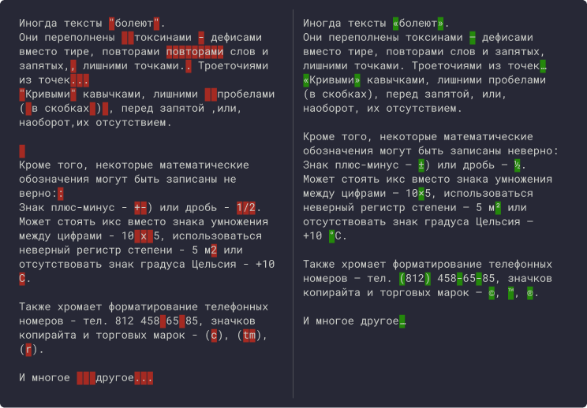

# Detoxit!
Workflow для [Alfred](https://www.alfredapp.com) c [Powerpack](https://buy.alfredapp.com/) на базе [Типографа на JavaScript](https://github.com/typograf/typograf)

## Привет!
Detoxit! помогает одним движением избавить текст от большинства «болячек» — неправильных кавычек, дефисов вместо тире, двойных пробелов и множественных переводов строки (всего [около 100 правил](https://github.com/typograf/typograf/blob/dev/docs/RULES.ru.md)).
 
 

 
 

## Установка
- **[Скачать Detoxit!](https://github.com/vandesign/alfred-detoxit/releases/download/v0.0.5/Detoxit.alfredworkflow)**

- Импортировать двойным кликом Detoxit.alfredworkflow в Alfred.

- Настроить горячие клавиши. Хоткей по умолчанию (`Command + Shift + =`).
 
 

 
 

- Detoxit! обрабатывает текст в буфере обмена. Копируем грязный текст (`Command + C`), нажимаем хоткей (`Command + Shift + =`), вставляем чистый текст (`Command + V`).

- Можно включать/выключать отдельные правила обработки текста. Начните набирать в Alfred `detoxitsetup`, нажмите `Return`.

- Выберите правило и включите или выключите его.

## Родители
Detoxit! работает на базе [Типограф на JavaScript](https://github.com/typograf/typograf).

Облачные функции — [typograf-now](https://github.com/tplk/typograf-now).

## Ближайшие планы
- Выбор локали.
- Дополнительная настройка отдельных правил.
- Обработка текста одним правилом.
- Предустановки для web-разработки.
- Сброс правил.
- Локальная Nodejs версия.
- **Принимаются предложения!**

## Лицензия

